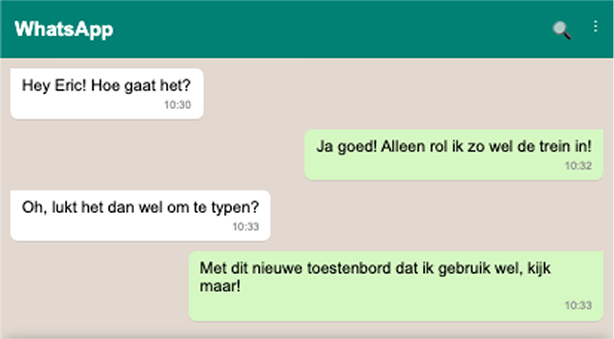

# Minor Web Design & Development: Human Centered Design


In dit project voor het vak Human Centred Design heb ik een toetsenbord ontwikkeld dat is afgeleid van een stenografisch toetsenbord, specifiek ontworpen voor gebruikers die slechts één vinger kunnen gebruiken. Het doel van dit toetsenbord is om het typen snel en efficiënt te maken door middel van woordsuggesties, die de gebruiker helpen bij het snel afmaken van woorden. Het ontwerp houdt rekening met de beperkingen van de gebruiker en biedt een intuïtieve interface die de interactie vereenvoudigt. In deze README wordt uitgelegd wat het product doet, hoe het werkt en welke aanpassingen zijn gemaakt op basis van feedback en gebruikerstests om de functionaliteit te optimaliseren.

<hr>

# De Gebruiker
Maak kennis met Eric, een energieke man van 52 jaar die ondanks zijn lichamelijke beperking een indrukwekkend actief leven leidt. Eric zit in een rolstoel vanwege een aangeboren aandoening waarbij sommige spieren en pezen in zijn lichaam niet of slechts gedeeltelijk zijn ontwikkeld. Hoewel dit invloed heeft op zijn mobiliteit en bereik, staat Eric opvallend positief in het leven.

Zijn dagen zijn goed gevuld: hij werkt als beleidsmedewerker met de focus op toegankelijkheid en mobiliteit. Daarnaast geeft hij regelmatig workshops en lessen, waarin hij zijn kennis deelt over inclusiviteit en technologische hulpmiddelen. Eric woont in een Fokus-woning — een plek waar hij zelfstandig kan wonen met 24/7 assistentie wanneer dat nodig is. Zijn leven is goed afgestemd op zijn behoeften, van een aangepaste auto tot de slimme plaatsing van zijn telefoon op het bedieningspaneel van zijn rolstoel.

Eric is een Android-gebruiker, maar hij is niet merkgebonden: een iPhone is ook prima, zolang het toestel maar groot is en goed werkt met zijn stylus. Hij gebruikt zijn telefoon op een specifieke manier: het toestel ligt vast op het bedieningspaneel en hij bedient het scherm met een stylus. Tikken en swipen gaan hem goed af, al is typen soms lastig. Lange swipes of ingewikkelde gestures vermijdt hij liever. Het gebruik van autocorrectie en woordenuggesties maakt zijn leven makkelijker, omdat het hem veel overbodige bewegingen bespaart.

Wat opvalt is hoe goed Eric weet wat voor hem werkt, maar ook dat hij openstaat voor nieuwe oplossingen. Hij is nieuwsgierig, probeert dingen uit (zoals oogbesturing en aangepaste toetsenborden), en staat altijd open voor tools die zijn digitale leven makkelijker maken — zolang het maar praktisch en haalbaar is in zijn situatie.

# Het Idee
Het idee is om een toetsenbord te creëren dat is afgeleid van een stenografisch toetsenbord, maar speciaal aangepast voor gebruik met één vinger. Omdat de gebruiker slechts één vinger heeft, is het ontwerp geoptimaliseerd voor eenvoudige interactie. Het toetsenbord maakt gebruik van woordsuggesties om de gebruiker snel te helpen bij het afmaken van woorden, waardoor typen sneller en efficiënter wordt, ondanks de beperking van het gebruik van slechts één vinger.

# Proces

## Week 1: De Kennismaking
In de eerste week ben ik vooral bezig geweest met het leren kennen van Eric en zijn situatie. Ik had een uitgebreid gesprek met hem waarin ik vragen stelde over zijn dagelijks leven, zijn gebruik van technologie, en waar hij in de praktijk tegenaan loopt. Ik merkte al snel dat hij ontzettend veel weet over zijn eigen gebruiksgedrag — hij is dus niet iemand die “geholpen moet worden”, maar eerder iemand die graag meedenkt.

Wat mij vooral is bijgebleven, is hoe hij zijn telefoon gebruikt in de trein. Tijdens het reizen wil hij graag berichten typen, notities maken of gewoon even scrollen op social media. Maar doordat zijn telefoon vastligt op het bedieningspaneel en hij met een stylus werkt, wordt typen lastig zodra de trein beweegt. De trillingen van de trein én de vering van zijn rolstoel zorgen ervoor dat hij moeilijk raak tikt. Soms wacht hij zelfs met typen tot de trein weer stilstaat.

Ik vond dat een belangrijk inzicht: het probleem zit niet in het apparaat zelf, maar in de omstandigheden waarin hij het gebruikt. Dat werd het startpunt van mijn ontwerpproces: hoe kan ik een manier ontwikkelen om tóch te kunnen typen of communiceren, ook als alles om je heen beweegt?

## Week 2: Onderzoek & Eerste Richting

<div>
  
  
</div>
Na mijn gesprek met Eric in week 1 was ik ervan overtuigd dat het probleem niet zozeer zit in het wíllen communiceren, maar in het fysiek kúnnen communiceren — zeker in bewegende situaties. Daarom ben ik deze week in de wereld van alternatieve invoermethoden gedoken: manieren waarop mensen met een fysieke beperking tóch efficiënt tekst kunnen invoeren op een apparaat.

Wat ik onderzocht
Ik ben begonnen met het verzamelen van verschillende manieren waarop mensen kunnen typen of woorden kunnen vormen:

- Een fysiek toetsenbord

- Spraakherkenning (speech to text)

- Handschriftherkenning

- Een brailletoetsenbord

- Oogbesturing

- Morsecode

- Custom invoerapparaten

- Een digitaal toetsenbord met aanpassingen

Wat werkt (en wat juist niet) voor Eric?
Met Eric's situatie als uitgangspunt ben ik elk van deze methodes gaan afwegen:

- Fysiek toetsenbord:
Interessant, maar te lomp en niet praktisch voor dagelijks gebruik — vooral in zijn rolstoel. Het zou letterlijk in de weg zitten.

- Spraakherkenning:
Theoretisch top, maar in de praktijk lastig. In de trein is het luidruchtig, en het is ook niet echt fijn om persoonlijke dingen hardop te moeten zeggen in een volle coupé.

- Handschriftherkenning:
Zou kunnen, maar kost veel bewegingen per woord — zeker met een stylus. En in een schuddende trein is dat niet bepaald een feestje.

- Brailletoetsenbord:
Geen optie. Eric is niet blind en heeft moeite met zijn vingers, dus de fijne motoriek die hiervoor nodig is ontbreekt.

- Oogbesturing:
Heel tof als concept, maar niet realistisch in de context van zijn huidige setup. Zijn telefoon staat te laag en te schuin om goed met oogtracking te kunnen werken.

- Morsecode:
En toen viel het kwartje. Morsecode lijkt ineens ontzettend logisch. Je hebt maar één knop nodig, het werkt met ritme (kort/lang), en het vereist minimale beweging. Perfect voor een stylus-gebruiker in een bewegende omgeving.

Mijn inzicht van de week
Het was alsof alles op zijn plek viel.
Waarom het wiel opnieuw uitvinden als er al een minimalistisch, ritmisch communicatiesysteem bestaat dat met één input werkt? Morsecode is natuurlijk niet nieuw, maar wél verrassend toepasbaar in deze context. En het leuke is: het kan Eric zelfs wat autonomie teruggeven. Geen ingewikkelde interfaces, geen meerdere vingers nodig — gewoon één duidelijke input.

Dit gaf me meteen nieuwe energie en richting:
Wat als ik een morse-gebaseerd invoersysteem bouw dat speciaal is ontworpen voor gebruik in beweging, met minimale input en maximale output?

Kleine iteraties en feedbackmomenten
Ik heb deze week met een aantal klasgenoten gebrainstormd en de eerste minitestjes gedaan met simpele morse-interfaces op het scherm. Wat meteen duidelijk werd:

Ritme en timing zijn belangrijk — een klein verschil tussen een “.” en een “-” moet makkelijk in te geven zijn

Feedback (visueel of audio) is essentieel om het systeem begrijpelijk en intuïtief te houden

Er is nog werk te doen aan gebruiksvriendelijkheid, maar het idee heeft potentie


## Week 3: Eric's Feedback & Layout verandering
<div>
  
  
</div>

In week 3 ben ik aan de slag gegaan met de feedback van Eric. Hij vond het indrukken van de knoppen prettig werken, maar begreep niet helemaal waarom ik juist voor deze specifieke knoppen had gekozen. Om dit beter te onderbouwen, ben ik gaan onderzoeken welke woorden het vaakst voorkomen in de Nederlandse taal. Vervolgens heb ik de eerste letters van die woorden gebruikt om mijn knoppenlayout te optimaliseren.

Daarnaast ben ik zelf op zoek gegaan naar extra functionaliteiten. Ik had al het idee om een volledig toetsenbord toe te voegen, maar realiseerde me dat het ook handig zou zijn om aparte tabbladen te maken voor cijfers en symbolen, zodat gebruikers sneller kunnen schakelen tussen invoermogelijkheden.

Tot slot heb ik mijn dictionary verder uitgebreid met meer lettercombinaties. Op die manier kan het systeem nog betere woordsuggesties doen, wat de gebruikservaring verder verbetert.

## Week 4: Toetsenbord habitat & laatste aanpassingen
<div>
  
  
  
  
  
  
  
</div>

In week 4 ben ik verder gegaan met het verbeteren van het toetsenbord Habitat, mede op basis van de feedback van mijn medestudenten. Helaas was Eric er niet bij de vorige test, maar ik heb zijn suggesties en die van anderen toegepast om de gebruikerservaring te verbeteren. Een belangrijke wijziging was het aanpassen van de structuur van de blokken waarop Eric kan klikken en interactie kan hebben. Dit zorgde ervoor dat de woordstukken nu beter bij elkaar staan en het toetsenbord intuïtiever werkt.

Naast de structurele aanpassingen heb ik ook de gebruiksvorm verder uitgewerkt. Het toetsenbord is nu volledig functioneel binnen een soort WhatsApp-klon, waardoor de gebruiker virtueel kan praten. Dit heb ik vandaag getest met Eric, die bijzonder tevreden was over de vooruitgang. Hij gaf aan dat het toetsenbord zeker een nuttige tool zou zijn, maar hij moest er nog even aan wennen en leren hoe het het beste te gebruiken.

Tijdens deze test ontdekte ik ook dat het volledige toetsenbord in feite overbodig was voor de toepassing. Het bleek dat slechts de letters Z en Q daadwerkelijk werden gebruikt, wat me ertoe bracht om het ontwerp aan te passen. Ik heb ervoor gekozen om alleen deze letters toe te voegen aan het originele ontwerp van het toetsenbord en het volledige toetsenbord te verwijderen. Deze aanpassing maakt het ontwerp eenvoudiger en efficiënter.

Daarnaast kwam ik er tijdens de test achter dat het niet mogelijk was om dubbel te klikken op een letter, wat essentieel is voor het correct maken van woorden. Dit had natuurlijk een negatieve impact op de functionaliteit. Daarom heb ik dit probleem opgelost door de mogelijkheid voor dubbelklikken toe te voegen, zodat gebruikers nu zonder problemen woorden kunnen vormen door snel achter elkaar op dezelfde letter te klikken.

Met deze laatste aanpassingen ben ik nu tevreden over het ontwerp en de functionaliteit van het toetsenbord. De belangrijkste feedback van Eric was positief, en de nieuwe features lijken goed te werken. Het toetsenbord is nu veel gebruiksvriendelijker en eenvoudiger in te zetten voor virtuele communicatie.

## Breakdown: Hoe zit de html in elkaar?
De html spreekt redelijk voor zich, ik heb een header met whatsapp, een block voor de chats & het keyboard wat naar boven komt waneer de gebruik op de desbetreffende knop drukt.

Het keyboard bestaat wel uit een duidelijke structuur die invloed heeft op de flow voor de gebruiker. Naar aanleiding van deze flow de volgende html structuur:

### Keys
```html
<div class="keyboard" id="stenographKeyboard">
  <!-- Row 1 -->
  <div
    class="key"
    data-primary="S"
    data-secondary="R"
    data-tertiary="@"
  >
    <span>S</span>
    <span class="secondary">R</span>
    <span class="tertiary">@</span>
    <div class="mode-indicator"></div>
  </div>
  
  <!-- More keys... -->
</div>
```
Dit zijn de toetsenborden met de verschillende keys, elke key bestaat uit 3 waarden, een primary, secondary & tertiary. ook zit er een indicator in die laat zien hoevaak er op de key gedrukt is.
### Suggesties blok
```html
<div class="suggestions" id="suggestions"></div>
```
Daarboven bevindt zich het woord suggestie blok waar de gebruiker het woord ziet wat hij/zij/hen aan het typen is, tevens staan hier ook de eventuele woord suggesties die uit de dictionary komen.
### Key Controls
```html
<div class="controls">
  <button class="control-btn" id="enterBtn">Enter</button>
  <button class="control-btn" id="backspaceBtn">Backspace</button>
  <button class="control-btn clear" id="clearBtn">Clear</button>
  <button class="control-btn toggle" id="keyboardToggleBtn">
    Swap<br />Keys
  </button>
</div>
```
Daar weer boven bevinden zich de controls voor de keys en woord suggestie blok. Enter kan gebruikt worden om het woord te selecteren en toe te voegen aan de output (de gebruiker kan ook op het woord klikken om deze toe te voegen). De backspace verwijderd de laatse letter die is toegevoegd om een woord te maken. Clear zorgt ervoor dat alle letters worden verwijderd. Als laatste is de Swap Keys knop voor het veranderen van de key mode van primary naar secondary, secondary naar tertiary of tertiary weer naar primary.
### Toestenbord tabjes
```html
<div class="tabs">
  <button class="tab-btn active" id="stenographTab">Letters</button>
  <button class="tab-btn" id="symbolsTab">Symbols & Numbers</button>
  <button class="info-toggle" id="infoToggle">?</button>
</div>
```
Het blok daarboven is om te swappen tussen het toetsenbord met de letters of het toetsenbord dat cijfers en symbolen bevat.
### Zin preview
```html
<div class="output-container">
  <textarea class="output-area" id="output" readonly></textarea>
  <div class="output-buttons">
    <button class="word-delete-btn" id="wordDeleteBtn">Delete Word</button>
    <button class="send-keyboard-btn" id="sendKeyboardBtn">Send</button>
  </div>
</div>
```
Het laatste belangrijke blok waar de woorden aantoegevoegd worden die de gebruik typt, dit is een soort preview van de zin. Die de gebruiker tot dus ver heeft getypt. Hier kunnen woorden weg gehaald worden, of er voor gekozen worden om de zin aan de chat te geven.

## Breakdown: Hoe zit de Javascript in elkaar?
De javascript is niet heel ingewikkeld maar wel belangrijk om de nodige functies uit te leggen!

### Debugging
```js
 const DEBUG = false; // Set to true to enable debugging

    function log(...args) {
        if (DEBUG) console.log('[Stenograph Keyboard]', ...args);
    }
```
Deze functie maakt het makkelijk om duidelijk mijn logs uit te lezen, maar boven al om de logs in een keer helemaal uit te zetten.

### Elemeten toevoegen
```js
function getElement(id) {
    const element = document.getElementById(id);
    if (!element) console.warn(`Element with id "${id}" not found`);
    return element;
}

const elements = {
    stenographKeyboard: getElement('stenographKeyboard'),
    symbolsKeyboard: getElement('symbolsKeyboard'),
    suggestions: getElement('suggestions'),
    output: getElement('output'),
    // ... more elements
};
```
Kleine functie om elementen die ik in de code zoek eerst laat zoeken of ze wel echt bestaan, voorkom hierdoor null refferences op elementen die niet bestaan.
Hierna maak ik een een object aan waar ik alle elementen in opsla.

### Toetsenbord openen/sluiten
```js
function toggleKeyboardPopup(show) {
    if (!elements.keyboardPopup) return;
    
    if (show === undefined) {
        elements.keyboardPopup.classList.toggle('active');
    } else if (show) {
        elements.keyboardPopup.classList.add('active');
    } else {
        elements.keyboardPopup.classList.remove('active');
    }
}
```
kleine functie om het toestenbord open en dicht te klappen. met wat error handling om sws te kijken of het element bestaat, maar ook of de parameter niet 'undefined' is.

### Toetsenbord swapper
```js
function switchKeyboardTab(targetTab) {
    const keyboards = {
        'stenograph': elements.stenographKeyboard,
        'symbols': elements.symbolsKeyboard
    };
    
    const tabs = {
        'stenograph': elements.stenographTab,
        'symbols': elements.symbolsTab
    };
    
    // Hide all keyboards and deactivate all tabs
    Object.values(keyboards).forEach(kb => { if (kb) kb.style.display = 'none'; });
    Object.values(tabs).forEach(tab => { if (tab) tab.classList.remove('active'); });
    
    // Show the selected keyboard and activate its tab
    if (keyboards[targetTab]) keyboards[targetTab].style.display = 'grid';
    if (tabs[targetTab]) tabs[targetTab].classList.add('active');
    activeKeyboard = targetTab;
}
```
Functie die ervoor zorgt dat de verschillende toetsenborden die ik heb (de letters en de cijfers/symbolen) aangepast worden. Met een Object.values loop ik er door heen om eerst alles uit te zetten. Wanneer de parameter gelijk staat aan de key uit de objecten dan wordt style ik toetsenborden. Ook wordt er doorgegeven aan de rest van de code welk toetsenbord actief is geworden.

### Key selectie
```js
function addKeySelection(key) {
    if (!key) {
        console.warn('Attempted to add null/undefined key');
        return false;
    }
    
    log(`Adding key: "${key}"`);
    
    // Always add the key, allowing it to be repeated
    selectedKeys.push(key);
    log('Updated selectedKeys:', selectedKeys);
    return true; // Key was added
}
```
Kleine functie om de waarde van de key te kunnen toevoegen aan de woord array.

### Key klikken
```js
function handleKeyClick(key, isSymbolsKeyboard = false) {
    if (!key) {
        log('No key element found in click handler');
        return;
    }
    
    log('Key clicked:', key);
    
    // For stenograph or symbols keyboard
    const primaryKey = key.dataset.primary;
    const secondaryKey = key.dataset.secondary;
    const tertiaryKey = key.dataset.tertiary;
    
    // Count how many times this key has been pressed
    let pressCount = 0;
    let keyAdded = false;
    
    // Select key based on current mode and add it
    if (keyboardMode === 0 && primaryKey) {
        // Primary mode
        keyAdded = addKeySelection(primaryKey);
        pressCount = selectedKeys.filter(k => k === primaryKey).length;
    } else if (keyboardMode === 1 && secondaryKey) {
        // Secondary mode
        keyAdded = addKeySelection(secondaryKey);
        pressCount = selectedKeys.filter(k => k === secondaryKey).length;
    } else if (keyboardMode === 2 && tertiaryKey) {
        // Tertiary mode
        keyAdded = addKeySelection(tertiaryKey);
        pressCount = selectedKeys.filter(k => k === tertiaryKey).length;
    }
    
    // Visual feedback for multiple presses
    if (pressCount > 1) {
        // Add visual indication
        // ...
    }
    
    updateKeyboard();
}
```
De keys hebben 3 states: primary, secondary & tertiary. Om te kijken welke waarde doorgegeven moet worden kijkt deze naar de key haalt hier uit de data attributen de waarden. Ik kijk naar de globale waarde van de swap keys modus (0, 1 of 2) hierop bepaal ik welke waarde wordt doorgegeven. Ook kijk ik naar hoeveel keer de knop is ingedrukt door uit de woord array te halen hoe vaak de letter er in voor komt.


### Woord suggesties uit de Dictionary
```js
function updateSuggestions() {
    if (!elements.suggestions) {
        console.error('Suggestions element is missing');
        return;
    }
    
    log('Running updateSuggestions()');
    log('Current selectedKeys:', selectedKeys);
    
    // Clear existing suggestions
    elements.suggestions.innerHTML = '';
    
    // Exit if no keys selected
    if (selectedKeys.length === 0) {
        log('No keys selected, exiting updateSuggestions');
        return;
    }
    
    // Ensure dictionary is defined and using window.dictionary for global access
    const dict = window.dictionary || {};
    
    // Get the sequence of keys
    const rawSequence = selectedKeys.join('');
    
    // Try different case formats for exact matches
    let words = [];
    
    // Try exact match (case sensitive)
    if (dict[rawSequence]) {
        words = [...dict[rawSequence]];
    } 
    // Try uppercase
    else if (dict[rawSequence.toUpperCase()]) {
        words = [...dict[rawSequence.toUpperCase()]];
    }
    // Try lowercase
    else if (dict[rawSequence.toLowerCase()]) {
        words = [...dict[rawSequence.toLowerCase()]];
    }
    
    // For partial matches if no exact match found
    if (words.length === 0) {
        // Create a regex pattern to match our sequence
        const pattern = new RegExp(rawSequence, 'i');
        
        Object.entries(dict).forEach(([combo, wordList]) => {
            // Check if the combo contains our pattern
            if (pattern.test(combo)) {
                words = [...words, ...wordList];
            }
        });
        
        // Also check if our keys are a subset of any combo
        const uniqueKeys = [...new Set(selectedKeys)];
        
        Object.entries(dict).forEach(([combo, wordList]) => {
            const comboChars = combo.split('');
            const isSubset = uniqueKeys.every(key => 
                comboChars.includes(key) || 
                comboChars.includes(key.toUpperCase()) || 
                comboChars.includes(key.toLowerCase())
            );
            
            if (isSubset) {
                // Add non-duplicate words
                wordList.forEach(word => {
                    if (!words.includes(word)) {
                        words.push(word);
                    }
                });
            }
        });
    }
    
    // Add the direct word formed by the keys in sequence
    const directWord = rawSequence.toLowerCase();
    if (directWord.length > 0 && !words.includes(directWord)) {
        words = [directWord, ...words];
    }
    
    // Limit to configured number of suggestions
    words = words.slice(0, maxSuggestions);
    
    // Create suggestion elements
    words.forEach(word => {
        const suggElement = document.createElement('div');
        suggElement.className = 'suggestion';
        suggElement.textContent = word;
        suggElement.addEventListener('click', () => {
            appendWord(word);
            clearSelectedKeys();
        });
        elements.suggestions.appendChild(suggElement);
    });
    
    // Make sure suggestions are visible
    elements.suggestions.style.display = 'flex';
    elements.suggestions.style.visibility = 'visible';
}
```
Deze functie haalt de woorden uit de dictionary die overeen komen met de letters of symbolen die geselecteerd zijn. er zijn een paar if statements die ervoor zorgen dat de suggesties allemaal naar dezelfde opties kijken. Uppercase of Lowercase. Uiteindelijk stop ik deze woord suggesties in een klikbaar woord, wat toegevoegd kan worden aan de zin.

### Woord aan zin toevoegen
```js
function appendWord(word) {
    if (!elements.output) return;
    
    const currentText = elements.output.value;
    const needsSpace = currentText.length > 0 && 
                      !currentText.endsWith(' ') && 
                      !currentText.endsWith('\n');
    
    elements.output.value += needsSpace ? ` ${word}` : word;
}
```
Kleine functie voor het toevoegen van een woord aan de zin.

### Woord uit zin verwijderen
```js
function deleteLastWord() {
    if (!elements.output) return;
    
    const text = elements.output.value;
    if (text.length === 0) return;
    
    const lastSpaceIndex = text.lastIndexOf(' ');
    const lastNewlineIndex = text.lastIndexOf('\n');
    const lastIndex = Math.max(lastSpaceIndex, lastNewlineIndex);
    
    if (lastIndex === -1) {
        // No spaces or newlines, clear all
        elements.output.value = '';
    } else if (lastIndex + 1 < text.length) {
        // Delete the partial word after the delimiter
        elements.output.value = text.substring(0, lastIndex + 1);
    } else {
        // Find previous word
        const textBefore = text.substring(0, lastIndex);
        const prevLastIndex = Math.max(textBefore.lastIndexOf(' '), textBefore.lastIndexOf('\n'));
        
        elements.output.value = prevLastIndex === -1 ? '' : text.substring(0, prevLastIndex + 1);
    }
}
```
Voor het verwijderen van een woord uit een zin, maar waar ik moet opletten dat we de hypothetishe cursor op de juiste plek terug zetten. Dit doe ik voor als ik hierna weer een woord wil toevoegen.

### Knoppen listeners
```js
function setupEventListeners() {
    // Popup toggle
    if (popupToggleBtn) {
        popupToggleBtn.addEventListener('click', () => toggleKeyboardPopup());
    }
    
    // Touch and mouse events for keyboard handle
    if (elements.keyboardHandle && elements.keyboardPopup) {
        elements.keyboardHandle.addEventListener('touchstart', e => {
            touchStartY = e.touches[0].clientY;
        });
        
        // More touch and mouse event handlers...
    }
    
    // Key click handlers
    if (elements.stenographKeyboard) {
        elements.stenographKeyboard.addEventListener('click', event => {
            handleKeyClick(event.target.closest('.key'));
        });
    }
    
    // Control button handlers
    if (elements.enterBtn && elements.output) {
        elements.enterBtn.addEventListener('click', () => {
            if (selectedKeys.length > 0) {
                appendWord(selectedKeys.join('').toLowerCase());
                clearSelectedKeys();
            } else {
                elements.output.value += '\n';
            }
        });
    }
    
    // Physical keyboard support
    document.addEventListener('keydown', e => {
        // Handle physical keyboard input...
    });
}
```
Functie die alle interactieve knoppen klaar zet.

### Dictionary testen
```js
function checkDictionary() {
    if (typeof dictionary === 'undefined') {
        console.error('Dictionary is not defined');
        return;
    }
    
    log('Dictionary type:', typeof dictionary);
    log('Dictionary keys count:', Object.keys(dictionary).length);
    log('Sample dictionary entries:');
    
    // Print first 5 entries
    let count = 0;
    for (const key in dictionary) {
        if (count < 5) {
            log(`  "${key}": ${JSON.stringify(dictionary[key])}`);
            count++;
        } else {
            break;
        }
    }
    
    // Check if specific keys exist
    const keysToCheck = ['BO', 'A', 'DE', 'HET', 'VAN'];
    keysToCheck.forEach(key => {
        log(`'${key}' exists in dictionary:`, key in dictionary);
        if (key in dictionary) {
            log(`Value for '${key}':`, dictionary[key]);
        }
    });
}
```
Kijk of de dictionary is gezet, of de keys opties worden ingelzen, en een check of een aantal key opties werken. Dit doe ik omdat de dictionary nog wel eens een fout kan hebben als ik hem update met nieuwe object opties.

**Dat waren de functies voor het toetsenbord, ik heb nog een aantal functies voor hoe de chat symbiotiek werkt.**

### Bericht toevoegen met tijd
```js
function addMessage(text, type) {
    if (!elements.chatContainer || !text.trim()) return;
    
    const now = new Date();
    const hours = now.getHours();
    const minutes = now.getMinutes();
    const timeString = `${hours < 10 ? '0' + hours : hours}:${minutes < 10 ? '0' + minutes : minutes}`;
    
    const messageDiv = document.createElement('div');
    messageDiv.className = `message ${type}`;
    messageDiv.innerHTML = `
        <div class="message-content">${text}</div>
        <div class="message-time">${timeString}</div>
    `;
    
    elements.chatContainer.appendChild(messageDiv);
    elements.chatContainer.scrollTop = elements.chatContainer.scrollHeight;
}
```
Functie die de zin die de gebruiker heeft gemaakt aan de 'chat' toe voegt. Aleen wordt niet alleen het bericht toe gevoegd. Ook wordt de huidige tijd van de gebruiker meegegeven aan het bericht


